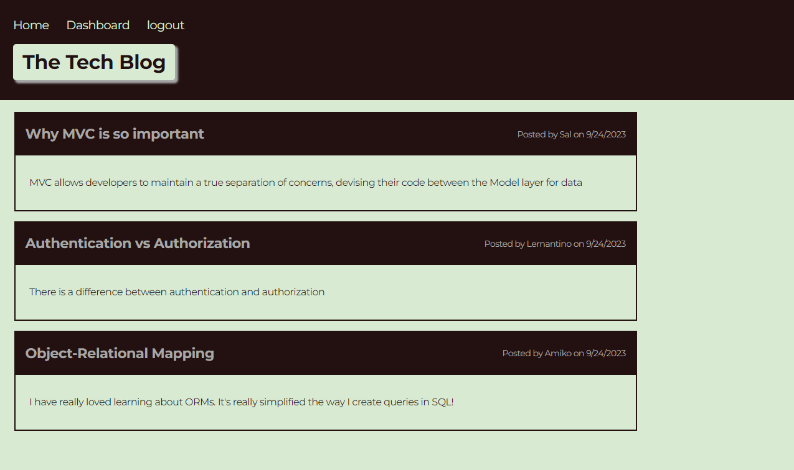

# tech-blog
 

## Description
This project is created to build a CMS-style blog site, akin to platforms like WordPress, where developers can publish blog posts and engage in discussions by commenting on each other's posts. The site will be created from scratch and deployed to Heroku, following the MVC architectural pattern. It will utilize Handlebars.js as the templating language, Sequelize as the Object-Relational Mapping (ORM) tool, and the express-session npm package for authentication.

## User Story
```
AS A developer who writes about tech
I WANT a CMS-style blog site
SO THAT I can publish articles, blog posts, and my thoughts and opinions
```

## Features

- User Authentication: Users can create accounts, log in, and log out securely.
- Create, Edit and Delete Posts: Users can create new blog posts and edit existing ones.
- Commenting: Users can comment on blog posts to engage in discussions.
- Dashboard: Users have access to a personal dashboard where they can manage their own posts.
- Responsive Design: The site is optimized for mobile, tablet, and desktop screens.


## Installation

To run the application locally, follow these steps:

1. Clone the repository to your local machine.
2. Run `npm install` to install the required dependencies.
3. Create a MySQL database and configure the connection in `.env` file.
4. Create the necessary database by entering the MySQL shell and running: `source db/schema.sql`
5. Run `npm run seed` to seed the database with initial data.
6. Run `npm start` to start the application.


## Technologies Used

- **Node.js**: Backend server environment.
- **Express.js**: Web application framework.
- **Handlebars.js**: Templating engine for rendering HTML.
- **Sequelize**: An ORM for interacting with the database.
- **MySQL Database**: To store user data, posts, and comments.
- **express-session**: For handling user sessions and authentication.
- **Heroku**: Cloud platform for deploying and hosting the application.

## Deployment

The application is deployed on Heroku and can be accessed [here](https://boiling-taiga-49561-29a503c2594b.herokuapp.com/).

## License
This project is licensed under the MIT license - see the [MIT License](https://opensource.org/licenses/MIT) file for details.

## Screenshot
